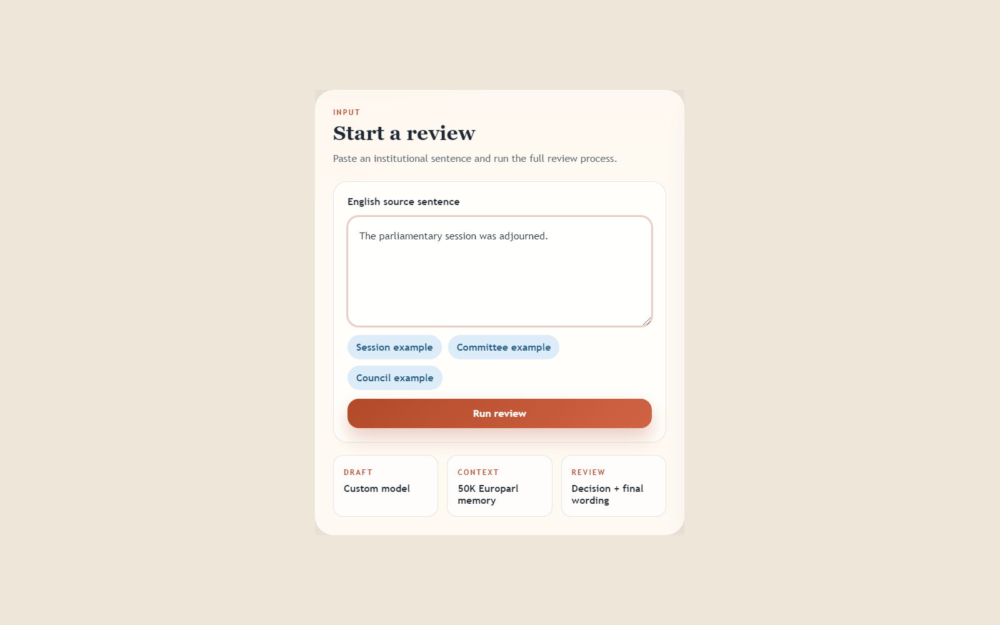

# Institutional Translation Review

Custom English-to-Spanish translation review system for institutional reviewers
who need a draft, bilingual evidence, review decision, and final wording in one
API/UI response. The custom PyTorch Transformer is one component in the workflow,
with optional retrieval and GPT-based review steps.

[](https://github.com/mathew-felix/english-spanish-translator/actions/workflows/ci.yml)
[](https://www.python.org/downloads/)
[](LICENSE)

Live demo: [Hugging Face Space](https://huggingface.co/spaces/mathew-felix/nmt-translator)

## Demo



The browser demo is centered on institutional review: source sentence, custom
model draft, retrieved bilingual examples when available, review
status, final translation, and latency.

## Core Workflow

`POST /institutional-review` is the primary product path.

```text
Institutional English source
        |
        v
Custom Transformer draft
        |
        v
Optional local bilingual evidence retrieval
        |
        v
Optional GPT reviewer assistance over retrieved context
        |
        v
Final Spanish wording plus provenance fields
```

`POST /translate` remains a supporting low-level endpoint for draft generation
and smoke tests.

## Architecture

```text
Browser UI / API client
        |
        v
src.serve FastAPI
        |
        +--> /institutional-review --> src.review core service
        |                               |--> source.inference custom draft
        |                               |--> optional rag.retriever evidence
        |                               `--> optional OpenAI reviewer
        |
        `--> /translate -------------> source.inference custom draft

Training/research path:
source.DatasetDownload -> source.DatasetPreprocessing -> source.Train -> source.Evaluate
```

## Quick Starts

Fast demo without downloading the 1.27 GB checkpoint:

```bash
python -m venv .venv
.venv\Scripts\python -m pip install -r requirements.txt
set TRANSLATOR_DEMO_MODE=1
.venv\Scripts\python scripts\preflight.py --skip-network
.venv\Scripts\python -m uvicorn src.serve:app --host 127.0.0.1 --port 8000
```

Full model path:

```bash
python -m venv .venv
.venv\Scripts\python -m pip install -r requirements.txt
.venv\Scripts\python scripts\download_model.py --tag eng-sp-tranlate
.venv\Scripts\python scripts\preflight.py
.venv\Scripts\python -m uvicorn src.serve:app --host 127.0.0.1 --port 8000
```

On macOS or Linux, replace `.venv\Scripts\python` with `.venv/bin/python`.

Optional installs:

```bash
.venv\Scripts\python -m pip install -r requirements-rag.txt       # ChromaDB retrieval
.venv\Scripts\python -m pip install -r requirements-gpt.txt       # GPT reviewer
.venv\Scripts\python -m pip install -r requirements-training.txt  # data/training/eval
.venv\Scripts\python -m pip install -r requirements-dev.txt       # tests and linting
```

Build local retrieval memory only when RAG dependencies and `data/train.csv` are
available:

```bash
.venv\Scripts\python rag\build_index.py
```

## API

Health:

```bash
curl http://127.0.0.1:8000/health
```

Institutional review:

```bash
curl -X POST http://127.0.0.1:8000/institutional-review ^
  -H "Content-Type: application/json" ^
  -d "{\"text\":\"The parliamentary session was adjourned.\"}"
```

Response fields include:

- `draft_translation`: custom model first pass.
- `retrieved_examples`: bilingual evidence with English, Spanish, and distance.
- `context_status`: whether local retrieval was available.
- `reviewer_status`: whether GPT review was used or skipped.
- `reviewer_explanation`: fallback reason when GPT was not used.
- `final_translation`: reviewed output.

Direct draft generation:

```bash
curl -X POST http://127.0.0.1:8000/translate ^
  -H "Content-Type: application/json" ^
  -d "{\"text\":\"The committee approved the amendment.\"}"
```

## Metrics

Research metrics from the training/evaluation run:

| Metric | Value | Context |
| --- | ---: | --- |
| Held-out sacreBLEU | `31.41` | Full `878,564` pair test set |
| Training pairs | `3,512,826` | OPUS corpus mix |
| Test pairs | `878,564` | OPUS corpus mix |
| Best validation loss | `2.5055` | Epoch 29 |
| Checkpoint size | about `1.27 GB` | GitHub release asset |

Baseline comparison from the 50-sentence manual set:

| Metric | Custom Transformer | MarianMT |
| --- | ---: | ---: |
| Average latency | `6518.67 ms` | `470.43 ms` |
| Exact reference matches | `11 / 50` | `20 / 50` |

Production metrics:

| Metric | Status |
| --- | --- |
| Historical local API examples | `/translate`: `21467.58 ms`; `/institutional-review`: `10508.06 ms` |
| `/translate` p50/p95 latency | Measure with `scripts/benchmark_inference.py` |
| `/institutional-review` p50/p95 latency | Measure with `scripts/benchmark_inference.py` |
| Throughput | Measure with `scripts/benchmark_inference.py` |
| Local demo startup / peak RAM | `23.747 s` to `/health`, `237.93 MB` peak RSS |
| Local full-model startup / peak RAM | `5.612 s` to `/health` with existing artifacts, `1900.72 MB` peak RSS |
| Local full-model review request | `4581.59 ms` client latency for `/institutional-review`; API-reported latency `4566.85 ms` |
| Cold start without existing artifacts / peak VRAM | Not measured; CUDA was not available in the local measurement |
| Hugging Face Space full-model smoke | Space loaded the `1.27 GB` checkpoint and returned a full-model UI response in about `11211.53 ms`; RAM was not measured |
| Docker validation | `docker compose up --build` returned `{"status":"ok"}` from `/health` |

Reviewer workflow simulation:

| Metric | Plain translation | Review workflow |
| --- | ---: | ---: |
| Traceability fields present | `10 / 30` | `30 / 30` |
| Traceability coverage | `33.33%` | `100.0%` |
| Curated evidence surfaced | not available | `5 / 5` demo tasks |

Reproduce the traceability measurement with
`scripts/reviewer_workflow_simulation.py`.
Measure local startup and memory with `scripts/measure_runtime.py --full-model`.

## Related Systems

Institutional translation workflows already rely on terminology and translation
memory infrastructure, including public-sector resources such as IATE and
DGT-TM. The workflow here follows the same review pattern: model draft,
retrieved bilingual evidence, reviewer decision, and final wording.

| System | Relevant capability | Local workflow coverage |
| --- | --- | --- |
| [DeepL glossaries](https://developers.deepl.com/api-reference/multilingual-glossaries) and [document translation](https://developers.deepl.com/api-reference/document) | Glossary and document workflows | Model draft, retrieved examples, fallback state, and code path are visible locally. |
| [Google Cloud Translation glossaries](https://docs.cloud.google.com/translate/docs/advanced/glossary) | Managed terminology control | Local review flow without managed glossary operations. |
| [Google adaptive translation](https://docs.cloud.google.com/translate/docs/advanced/adaptive-translation) | Example-pair adaptation | Retrieved examples for reviewer traceability, not managed adaptive MT. |
| [Azure Custom Translator](https://learn.microsoft.com/en-us/azure/ai-services/translator/custom-translator/overview) | Custom NMT with business terminology | Custom local model and serving stack. |
| MarianMT `Helsinki-NLP/opus-mt-en-es` | Strong open-source baseline | MarianMT is faster and stronger on the included 50-sentence comparison. |
| Raw GPT translation | Fluent general translation | GPT is optional here and only used as reviewer assistance over retrieved context. |

## Known Limitations

- The custom model is slower than MarianMT on the included comparison run.
- The custom model is weaker than MarianMT on exact reference matches in the
  included 50-sentence comparison.
- The full checkpoint is about `1.27 GB`; startup/download time depends on
  network and disk speed.
- The RAG index is local/generated and must be built unless a demo fixture is
  provided. The hosted Space can use a tiny curated fixture labelled as demo
  evidence.
- GPT revision requires `OPENAI_API_KEY` and the optional OpenAI dependency.

## Project Structure

```text
english-spanish-translator/
|-- assets/                  # Browser UI assets
|-- finetune/                # MarianMT comparison script and manual test set
|-- rag/                     # Optional ChromaDB translation-memory builder/retriever
|-- scripts/                 # Download, preflight, benchmark, and Space utilities
|-- source/                  # Data, model, training, evaluation, inference code
|-- src/                     # FastAPI app, CLI, env loader, review service
|-- templates/               # Browser UI template
`-- tests/                   # Contract, service, release, and optional smoke tests
```

## Testing

```bash
.venv\Scripts\python -m pip install -r requirements-dev.txt
.venv\Scripts\python -m ruff check .
.venv\Scripts\python -m pytest tests -v --cov=src --cov=scripts.download_model --cov-fail-under=60
.venv\Scripts\python -m pip_audit -r requirements.txt
```

The default tests are contract and service tests. They do not prove model quality.
Set `RUN_MODEL_SMOKE=1` to run the optional model-backed smoke test when local
artifacts are present.

## Reproducing Training

Install the training dependency set and run the pipeline:

```bash
.venv\Scripts\python -m pip install -r requirements-training.txt
.venv\Scripts\python -m src.run --step download
.venv\Scripts\python -m src.run --step preprocess
.venv\Scripts\python -m src.run --step train
.venv\Scripts\python -m src.run --step evaluate
```

The custom Transformer run used Python 3.12, seed `42`, and produced
`31.41` sacreBLEU on the held-out English-Spanish test split. Generated datasets,
tokenizers, checkpoints, experiment logs, and plots are intentionally ignored or
kept outside the repository.

## Deployment Notes

The hosted demo decision is a hybrid Hugging Face Space. It should default to
clearly labeled checkpoint-free demo mode and enable the full model only after
cold-start, RAM, and artifact-cache behavior are measured on the target Space
hardware. Full-model Space experiments can pull artifacts from
`mathew-felix/en-es-nmt-transformer` with:

```text
MODEL_ARTIFACT_SOURCE=huggingface
HF_MODEL_REPO=mathew-felix/en-es-nmt-transformer
TRANSLATOR_DEMO_MODE=0
TRANSLATOR_DEMO_MEMORY=1
```

## Security

The tracked tree is scanned for obvious secret patterns in CI tests. Keep API
keys in environment variables only, never in `.env` files committed to git.

## License

Licensed under the [MIT License](LICENSE).
