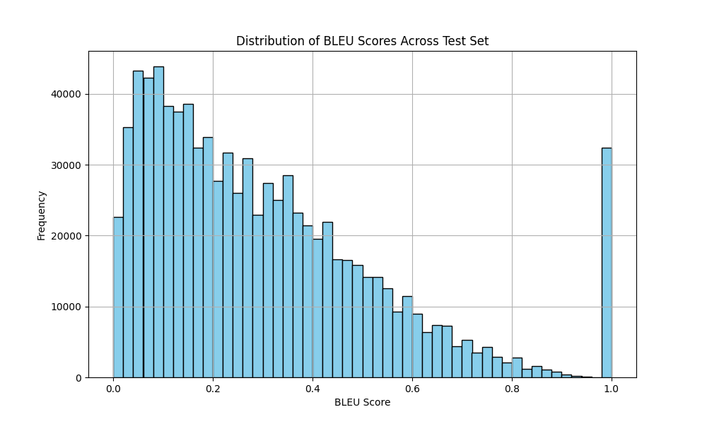
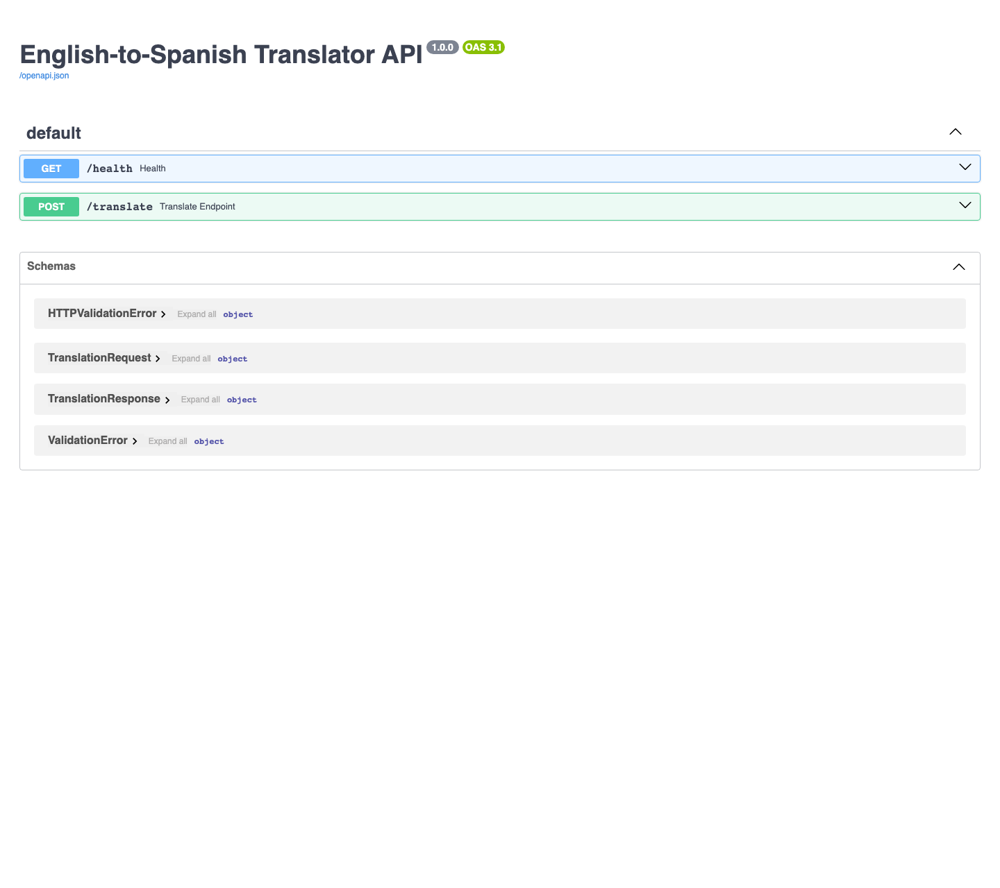

# English-to-Spanish Translator

[](https://wandb.ai/relixmatrix-texas-state-university/english-spanish-translator/runs/acxn0hti)

This project implements an English-to-Spanish translation system around a custom Transformer built from raw PyTorch modules. The repository focuses on one application: institutional translation review, where the custom model produces the first draft, retrieval memory finds similar Europarl examples, and GPT revises the draft before the final Spanish translation is returned.

This repository is presented as a focused ML systems project:

- train a translation model from scratch
- evaluate it honestly against a stronger pretrained baseline
- use retrieval and GPT only where domain-specific review is useful

## Latest Verified Run

The latest full end-to-end training run was completed in Colab and captured in `output.txt`.

| Item | Value |
| --- | --- |
| Hardware | NVIDIA RTX PRO 6000 Blackwell Server Edition |
| Epochs | 30 |
| Batch size | 640 |
| Max sequence length | 60 |
| Learning rate | `4.5e-4` |
| Train split | 3,512,826 pairs |
| Test split | 878,564 pairs |
| Best validation loss | `2.5055` at epoch 29 |
| Final test sacreBLEU | `31.41` |
| W&B run | `acxn0hti` (`silvery-galaxy-1`) |
| Full evaluation time | `2:33:37` |

Run links:

- Project: https://wandb.ai/relixmatrix-texas-state-university/english-spanish-translator
- Latest run: https://wandb.ai/relixmatrix-texas-state-university/english-spanish-translator/runs/acxn0hti

## What This Project Solves

The project is built for this problem:

- produce a first English-to-Spanish translation with a custom model
- improve institutional and parliamentary wording when terminology consistency matters

The main process is:

1. generate a draft with the custom Transformer
2. retrieve similar Europarl sentence pairs
3. review the draft with GPT using those examples
4. return the final Spanish translation

This design keeps the custom model as the core translation engine while using GPT only for the final revision step.

## What Is Actually Strong Here

- Custom encoder-decoder Transformer implemented from scratch in PyTorch
- Real large-scale training run on `4.39M` English-Spanish pairs
- Honest evaluation with `31.41 sacreBLEU` on the held-out test split
- Baseline comparison against `Helsinki-NLP/opus-mt-en-es`
- Focused review path for institutional translation
- FastAPI and Docker deployment so the system is runnable end to end

## Tech Stack

- Python 3.12
- PyTorch
- Hugging Face `transformers`
- FastAPI
- Pydantic v2
- Weights & Biases
- pandas / NumPy / matplotlib / tqdm / sacrebleu

Implementation note:

- LangGraph, ChromaDB, and GPT are used as supporting components for the review path
- they are not the main story of the project

## Installation

```bash
git clone https://github.com/mathew-felix/english-spanish-translator.git
cd english-spanish-translator
python3 -m venv venv
source venv/bin/activate
pip install -r requirements.txt
```

## Pipeline Usage

```bash
python run.py --step download
python run.py --step preprocess
python run.py --step train
python run.py --step evaluate
```

## Dataset Summary

The completed OPUS preprocessing run kept:

- `Europarl`: 1,940,734 pairs
- `News-Commentary`: 46,904 pairs
- `TED2020`: 403,752 pairs
- `OpenSubtitles`: 2,000,000 pairs

Total merged dataset:

- `4,391,390` aligned sentence pairs

Train/test split from the verified run:

- `3,512,826` train
- `878,564` test

## Training Results

The completed 30-epoch run showed stable training and steady validation improvement:

- epoch 1 validation loss: `4.2375`
- epoch 15 validation loss: `2.6032`
- epoch 29 validation loss: `2.5055`
- final full-test sacreBLEU: `31.41`

Per-sentence BLEU score distribution from the full held-out evaluation run on `878,564` test pairs:



Late-epoch qualitative samples from the training log:

- `How are you? -> ¿Cómo estás?`
- `Where is the hospital? -> ¿Dónde está el hospital?`
- `I need help with my homework. -> Necesito ayuda con mis deberes.`

Detailed run analysis is in `doc/TRAINING_REPORT.md`.

## Hugging Face Comparison

The repo now includes a direct comparison against the pretrained Hugging Face baseline `Helsinki-NLP/opus-mt-en-es`.

The preferred benchmark is now a clean hand-written 50-sentence set. This replaces the earlier dataset-derived comparison as the main reference because some corpus test rows were noisy or misaligned.

Artifacts:

- `finetune/baseline_hf.py`
- `finetune/manual_comparison_test_set.csv`
- `finetune/custom_model_results_manual.json`
- `finetune/baseline_results_manual.json`

Command used:

```bash
venv/bin/python finetune/baseline_hf.py \
  --csv-path finetune/manual_comparison_test_set.csv \
  --limit 50 \
  --custom-output custom_model_results_manual.json \
  --baseline-output baseline_results_manual.json
```

Manual comparison set:

- `5` Daily
- `5` Travel
- `5` Health
- `5` Work
- `5` Education
- `5` Emergency
- `5` Shopping
- `5` Social
- `5` Technology
- `5` Home

What the manual 50-sentence comparison showed on the local CPU run:

- MarianMT was stronger overall on fluency and lexical accuracy
- the custom Transformer still produced valid Spanish on many short and medium everyday prompts
- average latency was `6518.67 ms` for the custom model vs `470.43 ms` for MarianMT on this CPU run
- exact reference matches were `11 / 50` for the custom model vs `20 / 50` for MarianMT
- the biggest custom-model errors showed up on technology, shopping, and household phrasing
- the main quality gap is still best explained by pretrained data scale and model maturity, not by the impossibility of the basic encoder-decoder architecture itself

What this means:

- MarianMT is the stronger choice for broad everyday translation
- the custom model is still strong enough to prove the architecture and training pipeline are real
- the review path exists because the custom model benefits from extra domain-specific context on institutional language

Ten real side-by-side examples from the manual comparison set:

| English | Custom Transformer | Helsinki MarianMT |
| --- | --- | --- |
| Good morning, did you sleep well? | Buenos días, ¿durmió bien? | Buenos días, ¿durmieron bien? |
| Where can I buy a train ticket to Madrid? | ¿Dónde puedo comprar un billete de tren a Madrid? | ¿Dónde puedo comprar un billete de tren a Madrid? |
| I have had a headache since early this morning. | Tengo dolor de cabeza desde esta mañana. | He tenido dolor de cabeza desde temprano esta mañana. |
| The professor explained the problem step by step. | El profesor explicó el problema paso a paso. | El profesor explicó el problema paso a paso. |
| We need an ambulance right away. | Necesitamos una ambulancia enseguida. | Necesitamos una ambulancia de inmediato. |
| Can I pay by card, or do you only accept cash? | ¿Puedo pagar con tarjeta o sólo aceptar dinero? | ¿Puedo pagar con tarjeta, o solo aceptas efectivo? |
| We laughed so hard that we cried. | Nos reímos tanto que lloramos. | Nos reímos tanto que lloramos. |
| Did you remember to back up the files? | ¿Recuerdas retrasar los archivos? | ¿Te acordaste de hacer copias de seguridad de los archivos? |
| I need to reset my password again. | Necesito reanudar mi contraseña otra vez. | Necesito restablecer mi contraseña de nuevo. |
| The washing machine stopped working this morning. | La lavadora dejó de trabajar esta mañana. | La lavadora dejó de funcionar esta mañana. |

## Application

The main application path is institutional translation review:

1. submit an English institutional sentence
2. generate a first-pass draft with the custom model
3. retrieve the top 3 similar Europarl translation pairs
4. review the draft with GPT using those retrieved examples
5. return the final Spanish translation

Verified example:

```json
{
  "input": "The parliamentary session was adjourned.",
  "draft_translation": "Se suspendió la sesión parlamentaria.",
  "decision": "EDIT",
  "final_translation": "Se interrumpe la sesión parlamentaria."
}
```

## When To Use Each Path

Use `POST /translate` when:

- the sentence is ordinary everyday English
- you just want the direct custom-model output

Use `POST /institutional-review` when:

- the sentence is parliamentary, committee, council, motion, or amendment language
- terminology consistency matters more than raw speed

Do not overclaim this review path.

It is useful for institutional wording because the retrieval memory is built from Europarl. It is not intended as a universal improvement layer for all casual translation.

## API

Run the FastAPI server locally:

```bash
uvicorn serve:app --reload
```

Health check:

```bash
curl http://localhost:8000/health
```

Translation request:

```bash
curl -X POST http://localhost:8000/translate \
  -H "Content-Type: application/json" \
  -d '{"text": "Where is the nearest hospital?"}'
```

Observed local response from the current checkpoint:

```json
{
  "input": "Where is the nearest hospital?",
  "translation": "¿Dónde está el hospital más cercano?",
  "latency_ms": 21467.58
}
```

The exact latency depends on local hardware. The response above is from the latest local verification run on CPU.

Institutional review request:

```bash
curl -X POST http://localhost:8000/institutional-review \
  -H "Content-Type: application/json" \
  -d '{"text": "The parliamentary session was adjourned."}'
```

Observed response:

```json
{
  "input": "The parliamentary session was adjourned.",
  "draft_translation": "Se suspendió la sesión parlamentaria.",
  "decision": "EDIT",
  "final_translation": "Se interrumpe la sesión parlamentaria.",
  "retrieved_examples": [
    {
      "english": "The session is adjourned.",
      "spanish": "Se interrumpe el periodo de sesiones.",
      "distance": 0.177841
    },
    {
      "english": "Adjournment of the session",
      "spanish": "Interrupción del periodo de sesiones",
      "distance": 0.225302
    },
    {
      "english": "I declare adjourned the session of the European Parliament.",
      "spanish": "Declaro interrumpido el período de sesiones del Parlamento Europeo.",
      "distance": 0.298554
    }
  ],
  "latency_ms": 10508.06
}
```

Swagger UI screenshot:



Browser walkthrough GIF:


## Architecture Summary

The project should be described in this order:

1. custom translation model from scratch
2. large-scale training and evaluation
3. baseline comparison against MarianMT
4. institutional review path built on top of the model

That is the correct emphasis.

The project should not be described primarily as:

- a general-purpose Spanish helper
- an all-purpose automation product
- a research contribution on large language models

## Weights & Biases

Set your API key before training if you want online tracking:

```bash
export WANDB_API_KEY=your_api_key
python run.py --step train
```

Latest verified run:

- https://wandb.ai/relixmatrix-texas-state-university/english-spanish-translator/runs/acxn0hti

## Reports

- `doc/PROJECT_REPORT.md`: current project-wide status
- `doc/PROJECT_FASTAPI_REPORT.md`: FastAPI inference layer report
- `doc/PROJECT_AGENT_REPORT.md`: focused LangGraph routing report
- `doc/PROJECT_RAG_REPORT.md`: translation-memory review report
- `doc/TRAINING_REPORT.md`: completed training run report
- `doc/HF_COMPARISON_REPORT.md`: Hugging Face baseline comparison report
- `doc/MODEL_SPOTCHECK_REPORT.md`: exported checkpoint spot-check results

## License

This project is licensed under the MIT License.
