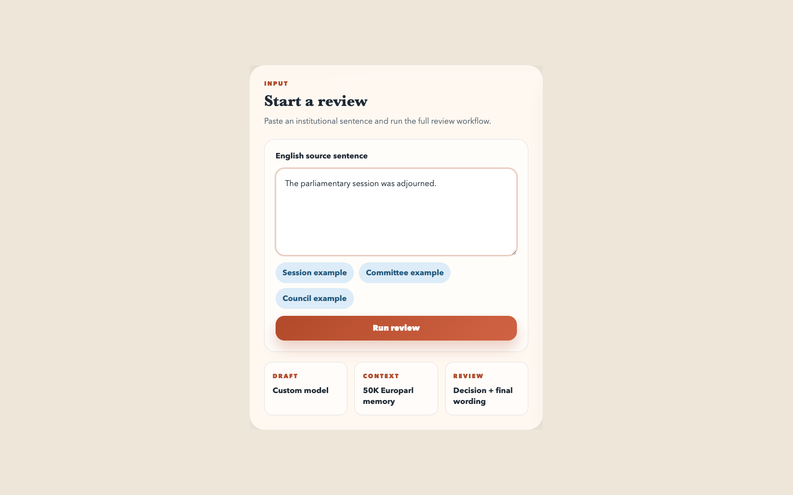

# English-to-Spanish Translator

[](https://wandb.ai/relixmatrix-texas-state-university/english-spanish-translator/runs/acxn0hti)

This project is built around a custom English-to-Spanish Transformer written in PyTorch and trained end to end on a large parallel corpus. The main work in the repository is the ML pipeline: data preparation, training, evaluation, and comparison against a MarianMT baseline. Around that model, the repo also includes the pieces needed to serve translations and handle institutional text with retrieved Europarl examples and a GPT revision step.

## Highlights

- custom encoder-decoder Transformer built from raw PyTorch modules
- large multi-corpus training pipeline over `4,391,390` aligned sentence pairs
- 30-epoch run with `31.41 sacreBLEU` on `878,564` held-out test pairs
- direct comparison against `Helsinki-NLP/opus-mt-en-es`
- FastAPI service, Docker packaging, and a second path for institutional translation

## Latest Run

| Item | Value |
| --- | --- |
| Hardware | NVIDIA RTX PRO 6000 Blackwell Server Edition |
| Epochs | 30 |
| Batch size | 640 |
| Max sequence length | 60 |
| Learning rate | `4.5e-4` |
| Train split | 3,512,826 pairs |
| Test split | 878,564 pairs |
| Best validation loss | `2.5055` at epoch 29 |
| Final test sacreBLEU | `31.41` |
| W&B run | [`acxn0hti`](https://wandb.ai/relixmatrix-texas-state-university/english-spanish-translator/runs/acxn0hti) |
| Full evaluation time | `2:33:37` |

## Overview

The repository has one trained model and two inference paths.

- `POST /translate` sends the input directly to the custom Transformer and returns the model output.
- `POST /institutional-review` starts with the same custom-model draft, retrieves three similar Europarl pairs, and then passes the draft and examples to GPT for the final wording revision.

### System Diagram

```text
                     Training Path
English-Spanish Data
        |
        v
  Preprocessing + Split
        |
        v
 Custom Transformer Training
        |
        v
 Evaluation + MarianMT Comparison
        |
        v
    best_model.pth


                    Inference Paths
User sentence
    |
    +-------------------------------> /translate
    |                                   |
    |                                   v
    |                           Custom Transformer
    |                                   |
    |                                   v
    |                            Spanish output
    |
    +-------------------------------> /institutional-review
                                        |
                                        v
                               Custom Transformer draft
                                        |
                                        v
                             Retrieve 3 Europarl examples
                                        |
                                        v
                                   GPT revision
                                        |
                                        v
                                 Spanish output
```

## Main Components

- `run.py` handles dataset download, preprocessing, training, and evaluation.
- `source/Model.py` contains the custom Transformer.
- `source/inference.py` loads the checkpoint once for inference.
- `serve.py` exposes the FastAPI endpoints.
- `finetune/baseline_hf.py` runs the MarianMT comparison.
- `rag/` stores the translation-memory builder and retriever.

## Quick Start

Install:

```bash
git clone https://github.com/mathew-felix/english-spanish-translator.git
cd english-spanish-translator
python3 -m venv venv
source venv/bin/activate
pip install -r requirements.txt
```

Run the ML pipeline:

```bash
python run.py --step download
python run.py --step preprocess
python run.py --step train
python run.py --step evaluate
```

Start the API:

```bash
uvicorn serve:app --reload
```

## API

- `GET /health`
- `POST /translate`
- `POST /institutional-review`

Example:

```bash
curl -X POST http://localhost:8000/translate \
  -H "Content-Type: application/json" \
  -d '{"text": "Where is the nearest hospital?"}'
```

Browser walkthrough:



## Documentation

Detailed training metrics, local testing notes, MarianMT comparison results, and MacBook M4 verification results are in `doc/PROJECT_REPORT.md`.

## License

This project is licensed under the MIT License.
